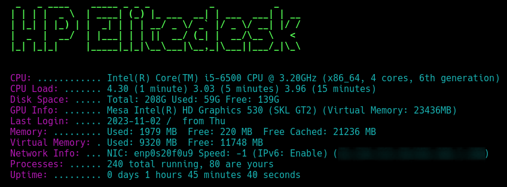

# Message of the Day


This repository contains a script named `message_of_the_day`, which provides a detailed overview of the system's current state each time a user logs into a Unix-like operating system. 
This script displays various system metrics like CPU usage, memory usage, disk space, network information, and more.

## Features

- **System Information**: Displays CPU model, architecture, core count, and generation.
- **CPU Load**: Shows system load for 1, 5, and 15 minutes intervals.
- **Disk Space**: Details about the disk space usage.
- **GPU Information**: (If available) Provides details about the GPU and its memory usage.
- **Last Login**: Information about the last login session.
- **Memory Usage**: Detailed memory usage including free and cached memory.
- **Virtual Memory**: (If applicable) Used and free virtual memory.
- **Network Information**: Details about network interface, speed, IPv6 status, WAN and LAN IPs.
- **Process Count**: Number of total running processes and user-specific processes.
- **Uptime**: System uptime in days, hours, minutes, and seconds.

## Prerequisites

To use this script, you need:
- A Unix-like operating system.
- Required tools: `awk`, `curl`, `ifconfig`, `date`, `figlet` (optional for header display).

## Installation

1. Clone the repository:
   ```bash
   git clone https://git.nr1.nu/wuseman/motd
   ```
2. Navigate to the script directory:
   ```bash
   cd motd
   ```
3. Make the script executable:
   ```bash
   chmod +x message_of_the_day.sh
   ```

## Usage

To run the script, simply execute it from the terminal:

```bash
./motd.sh
```

Or, you can integrate it into your system's login process by adding it to the appropriate profile file (like `.bash_profile` or `.bashrc`).

## Customization

The script is easily customizable. You can edit it to add or remove features based on your system's capabilities and your preferences.

## Contributing

Contributions are welcome! If you have suggestions or improvements, feel free to fork the repository and submit a pull request.

## License

This script is released under the [MIT License](LICENSE).

## Contact

For any queries or assistance, please open an issue on this GitHub repository.
